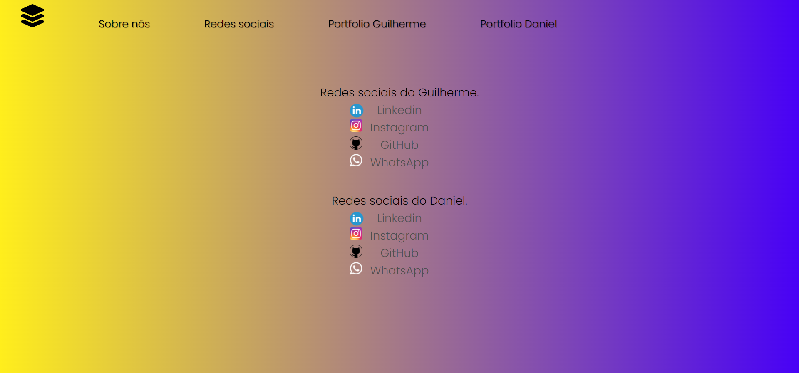

# Portfolio

> Presentation image about us and our goals.

 

> Image about our social networks.

 

> Added Guilherme's Portfolio to the project.

 

> Added Daniel's Portfolio to the project.

 

### Adjustments and improvements

The project is still under development and future updates will focus on the following tasks:

- [x] About Us.
- [x] Social networks.
- [x] Guilherme's Portfolio.
- [x] Daniel's portfolio.
- [ ] Create responsiveness.
- [ ] Portfolio in constant update.
 
[Portfolio](https://gui1703.github.io/Portfolio/) - Project Portfolio where the recruiter can analyze our knowledge and the projects made. The projects interact with the user without leaving the portfolio.

## 🤝 Contributors.

We thank the following people who contributed to this project:

<table>
  <tr>
    <td align="center">
      <a href="#">
         
        
          <b>Guilherme Raposo</b>
        
      </a>
    </td>
    <td align="center">
      <a href="#">
         
        
          <b>Daniel Vieira</b>
        
      </a>
    </td>
  </tr>
</table>